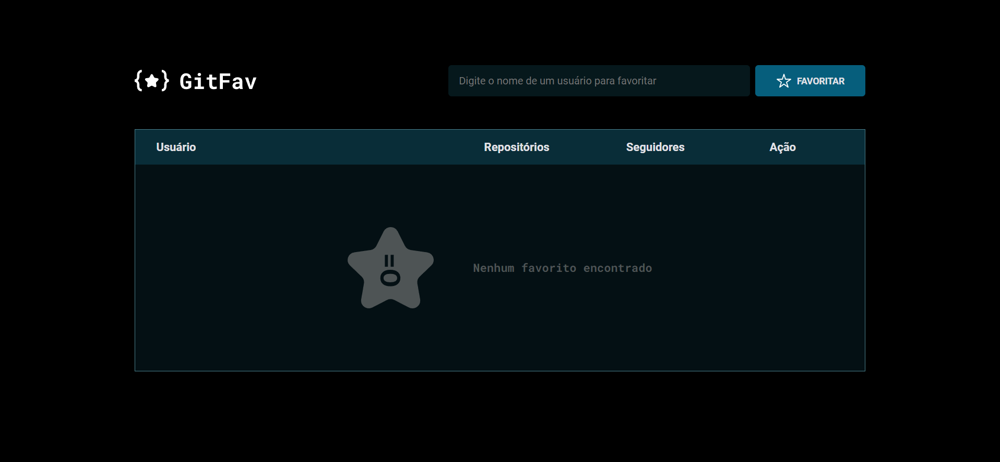
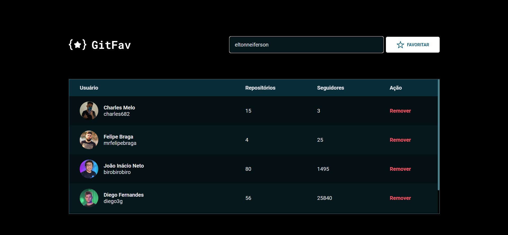
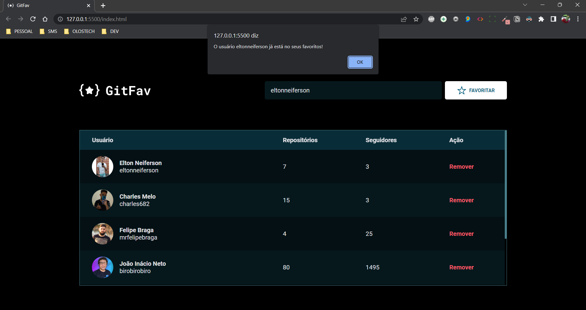
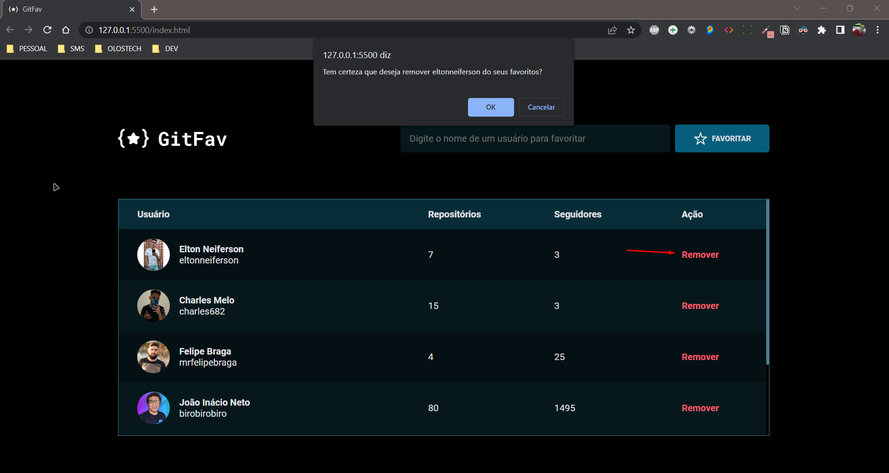
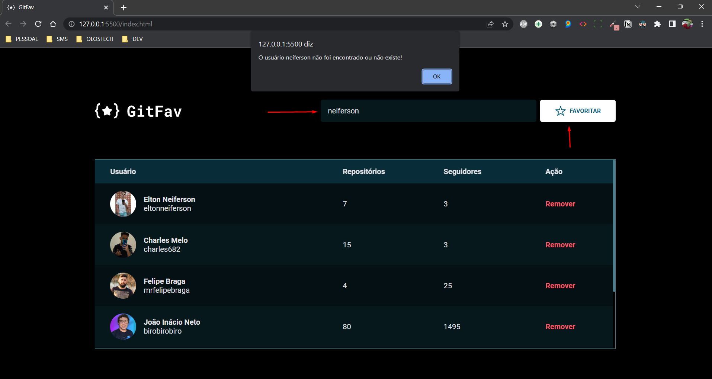

<h1 align="center">{⭐} GitFav</h1>

O GitFav é uma aplicação integrada com a API do GitHub para guardar seus usuários favoritos do GitHub. A aplicação armazena os dados no localStorage para que você não perca se atualizar a página, desde que abra sempre com o mesmo navegador do seu computador.

<h3>No GitFav você pode contar com as seguintes funcionalidades:</h3>

Salvar seus usuários favoritos do GitHub:

Verificar se o usuário já não está nos favoritos:

Remover um usuário dos favoritos:

Verificar se o usuário está correto ou se existe no GitHub:

<h2 align="center">Tecnologias utilizadas</h2>

  

